# **Guide d’installation & d’utilisation de Node-RED (dashboard V2)**

*Version du document : V1*

[](https://github.com/PlanktoScope/node-red-gui-refonte/tree/feat/doc/README.en.md)

## ***Sommaire***

- *Introduction*
- *Prérequis*
- *Installation sur le PlanktoScope*

## **Introduction**

Node-RED est un outil de développement visuel pour connecter des dispositifs matériels, des API et des services en ligne de manière nouvelle et excitante. Il offre une interface intuitive pour construire des flux d'applications en connectant des nœuds qui représentent des blocs de fonctionnalités distincts. Dans cette documentation, nous allons vous guider à travers le processus d'installation, de configuration, et d'utilisation de Node-RED, en particulier dans le contexte du PlanktoScope.

## **Prérequis**

* **PlanktoScope** : Assurez-vous que le PlanktoScope est correctement installé et accessible via SSH.  
* **Compte GitHub** : Un compte GitHub est nécessaire pour gérer les projets et les jetons d'accès (access tokens).  
* **Accès SSH** : Vous devez pouvoir vous connecter à votre PlanktoScope via SSH pour modifier les fichiers de configuration de Node-RED.


## **Installation sur le PlanktoScope**

1. **Accès au Dashboard V1 du PlanktoScope**

Après avoir inséré une carte SD contenant l'image du PlanktoScope, la V1 du dashboard est disponible en ligne. Vous pouvez accéder à la landing page du PlanktoScope via l'adresse suivante :

**Landing page :** `http://<adresse-ip-du-planktoscope>`

Depuis cette page, plusieurs options sont disponibles, dont :

* **Node-RED dashboard editor :** Ce lien vous donne accès à l'éditeur du dashboard. Cet éditeur vous permet de modifier et personnaliser les différents éléments du dashboard.

* **Node-RED dashboard :** Ce lien vous permet de voir la version V1 du dashboard. Cependant, veuillez noter qu'après l'installation de la version V2, ce lien ne fonctionnera plus.


2. **Démarrage du PlanktoScope**

**Ouvrir un terminal** : Commencez par ouvrir un terminal sur votre machine locale.  
**Connexion SSH** : Connectez-vous au PlanktoScope via SSH en utilisant la commande suivante :

```
ssh pi@<adresse-ip-du-planktoscope>
```

Remplacez \<adresse-ip-du-planktoscope\> par l'adresse IP de votre PlanktoScope.  
Puis entrer le mot de passe dans l’invite de commande qui devrait ressembler à ça :

```
Please note that SSH may not work until a valid user has been set up.

See http://rptl.io/newuser for details.
pi@92.167.184.163's password:<password>
```

Remplacez \<password\> par “copepode”.

3. **Configuration de Node-RED**  

3.1 **Modifier le fichier settings.js**

Pour configurer Node-RED, vous devez éditer le fichier de configuration settings.js.

A. **Localisation du fichier** : Le fichier settings.js se trouve dans le répertoire /etc/nodered/ accessible par la commande suivante : 

```
cd /etc/nodered/
```

Ouvrir le fichier fichier avec un éditeur de texte (*exemple “nano” ou “vim”*).

B. **Modification des paramètres** :  
   * **Activation du stockage de contexte (contextStorage)** : Retirez les commentaires pour activer le contextStorage. Cela permet de sauvegarder les données entre les redémarrages de Node-RED.  
   * **Mode projet** : Changez la valeur de enabled à true pour activer le mode projet. Cela vous permettra de gérer vos flux avec un contrôle de version via Git.

Exemple de modification dans settings.js pour le contextStorage :

```javascript
// Enlever les commentaires pour activer la partie suivante
contextStorage: {
    default: {
        module: "localfilesystem"
    }
},
```

### Exemple de modification dans settings.js pour le mode projet : 

```javascript
// Mettre à true la valeur de l'attibut "enable" dans la partie suivante
editorTheme: {
    projects: {
        enabled: true
    }
}
```

Une fois les modifications faites, sur “nano” vous devez faire “ctrl+x” puis “y” et la touche “enter” pour quitter tout en sauvegardant.

3.2 **Redémarrer Node-RED**

Après avoir modifié le fichier de configuration, redémarrez Node-RED pour appliquer les changements :

```
sudo systemctl restart nodered
```

Une fois Node-RED redémarré, ouvrez l'interface d'édition via un navigateur web en vous connectant grâce au lien sur la landing page :

- **Node-RED dashboard editor**

4. ## **Utilisation de Node-RED**

   A. **Interface d'édition**

Après avoir démarré Node-RED, vous serez accueilli par l'interface d'édition où vous pouvez créer et gérer vos flux. Avec le mode projet activé, vous pouvez maintenant gérer vos projets. 

<p align="center">
    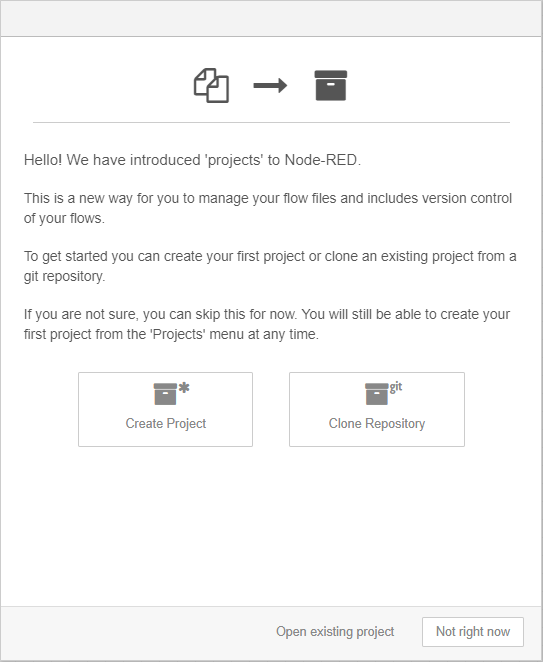
    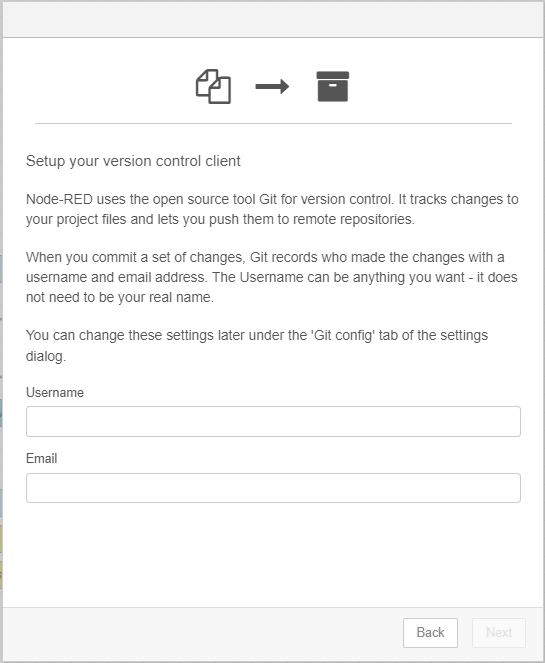
</p>

**Screen 1 :** Pour récupérer le Dashboard V2, veuillez cliquer sur Clone repository. 

**Screen 2 :** Veuillez remplir Username et Email par celles que vous souhaitez *(ex : Mettre vos identifiants Github actuel)*. Ces informations seront celles qui vous identifient lors des push/pull. Puis cliquez sur Next.

<div style="display: flex">
    <p align="center">
        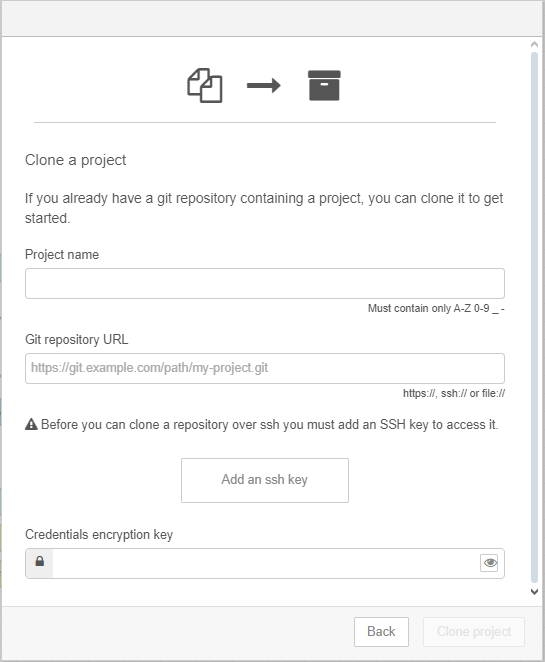
    </p>
    <p align="center">
        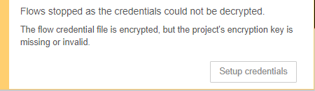
        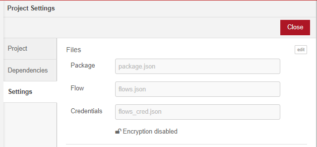
    </p>
</div>


**Screen 3 :** Ici vous allez devoir récupérer le lien .git du repository que vous souhaitez cloner. Dans notre cas le lien est le suivant : https://github.com/PlanktoScope/node-red-gui-refonte.git  
Copier coller ce lien dans la zone de texte Git repository URL va automatiquement récupérer le Project name. Veuillez maintenant remplir Username et Password par vos identifiants Github, puis cliquez sur Clone project.

**Screen 4 & 5 :** Si vous obtenez cet avertissement concernant les credentials, veuillez cliquer sur Setup credentials. Puis cliquez sur edit et sur le crayon, ensuite entrez une nouvelle clé qui servira d’encryptage *(ex: plk\_q8dSMZ7HIPyi8o7LSDJudWvd2B3Ro)* puis cliquez sur Save et Close*.* Une fois 

<div style="display: flex">
    <p align="center">
        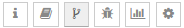
        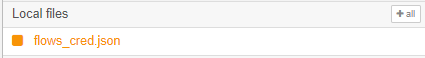
        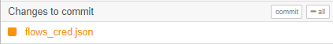
        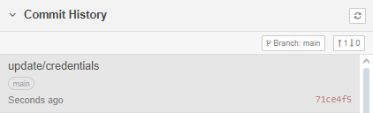
    </p>
</div>

**Screen 6 :** Cliquer sur l'icône grisée.

**Screen 7 & 8 & 9 :** Après avoir modifier les credentials vous aurez dans Local files les fichier node-RED qui ont été modifiés. Il vous suffit de cliquer sur \+all pour ajouter sélectionner les fichiers. Puis dans le **Screen 8** cliquez sur commit, une zone de texte va apparaître. Dedans veuillez écrire la description ce qui a été modifié, une explication courte de ce que vous avez fait, dans notre cas ça peut être update/credentials, puis cliquez sur Commit. Maintenant il faut cliquer sur Commit History, ce qui va ouvrir un onglet qui vous fera voir votre dernier commit et un bouton avec deux flèches, cliquez dessus, puis sur push.

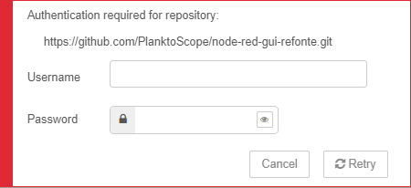

**Screen 10 :** Une fois l’étape **screen 9** finit, cette pop-up vous demande de renseigner vos identifiants de connexion Github. Ici votre Password est en réalité un access-token que vous allez devoir générer depuis Github, je vous renvoie vers la [documentation](https://docs.github.com/en/authentication/keeping-your-account-and-data-secure/managing-your-personal-access-tokens\#creating-a-personal-access-token-classic) en lien et une fois récupérer et rentrer dans Password, cliquez sur Retry.

Une fois toutes ses étapes finies, vous allez devoir redémarrer node-RED comme vous l’avez fait à l’étape **3.2 Redémarrer Node-RED**.

<div style="display: flex">
    <p align="center">
        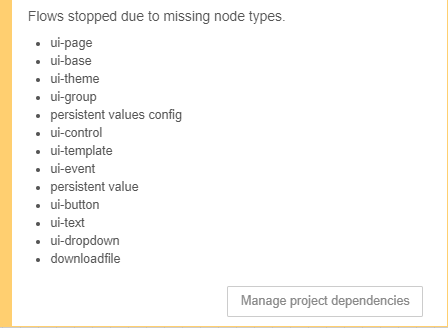
        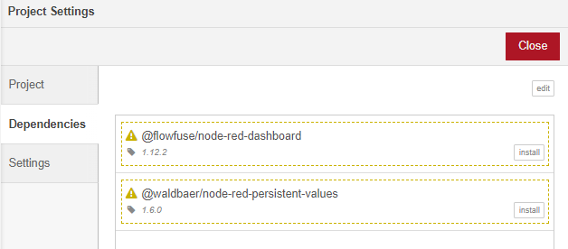
    </p>
</div>

**Screen 11 :** Une fois le dashboard rouvert, après redémarrage, node-RED vous dit qu’il y a des dépendances manquantes. Il suffit d’aller dans Manage project dependencies.

**Screen 12 :** Vous pouvez voir ici les deux dépendances que node-RED proposent, vous avez juste à cliquer sur install puis sur Close puis rafraîchissez la page internet.

<div style="display: flex">
    <p align="center">
        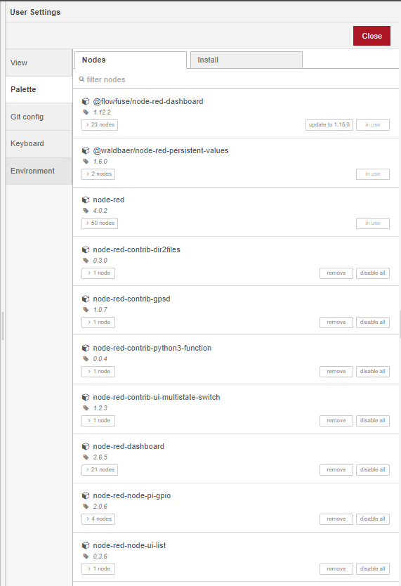
        
    </p>
</div>

**Screen 13 :** Il devrait vous rester une dépendance qui serait downloadfile. Ensuite cliquez sur Manage project dependencies.

**Screen 14 :** Ici vous avez la liste complète des dépendances. Vous allez devoir supprimer toutes celles qui ne sont plus utilisées. Dans notre cas : 
- node-red-contrib-dir2files,  
- node-red-contrib-gpsd,  
- node-red-contrib-python3-function,  
- node-red-contrib-ui-multistate-switch,  
- node-red-dashboard,  
- node-red-node-pi-gpio,  
- node-red-node-ui-list

Puis allez dans l’onglet Install cherchez et installez le module downloadfile *(@prescient-devices/node-red-contrib-downloadfile).* Une fois installé, vous avez besoin de rafraîchir la page et votre installation de la V2 en ligne avec github project est terminée.
